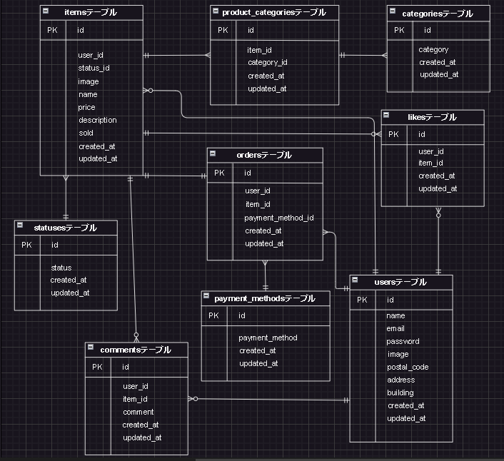

# marketplace

## 環境構築
Dockerビルド
・git clone https://github.com/sakura693/marketplace
・docker-compose up -d --build

## Laravel環境開発
1. docker-compose exec php bash
2. composer install
3. .envに以下の環境変数を追加 
    DB_CONNECTION=mysql 
    DB_HOST=mysql 
    DB_PORT=3306 
    DB_DATABASE=laravel_db 
    DB_USERNAME=laravel_user 
    DB_PASSWORD=laravel_pass
4. php artisan key:generate 
5. php artisan migrate 
6. php artisan db:seed

## 開発環境
・商品一覧画面：http://localhost/
・ユーザ登録画面：http://localhost/register
・phpmyadmin：http://localhost:8080/

## 使用技術（実行環境）
・PHP  8.3.9 
・Laravel 8.83.27
・MySQL 8.0.26 
・nginx 1.18.0

## ER図
