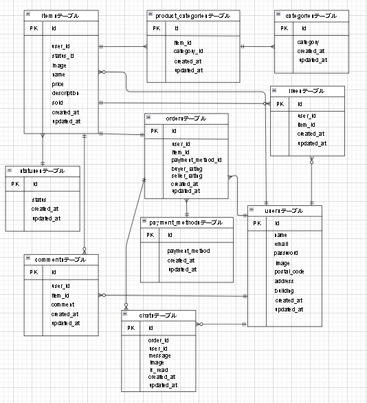

# marketplace

## 環境構築
Dockerビルド
- git clone https://github.com/sakura693/marketplace
- docker-compose up -d --build

## Laravel環境開発
1. docker-compose exec php bash　<br>
2. composer install　<br>
3. 「.env.example」ファイルを 「.env」ファイルに名前を変更。または、新しく.envファイルを作成。　<br>
4. .envに以下の環境変数を追加 　
```
    DB_CONNECTION=mysql 
    DB_HOST=mysql 
    DB_PORT=3306 
    DB_DATABASE=laravel_db 
    DB_USERNAME=laravel_user 
    DB_PASSWORD=laravel_pass
```
5. php artisan key:generate <br>
6. php artisan migrate <br>
7. php artisan db:seed　<br>
8. エラーが出る場合は sudo chmod -R 777 src/* を実行。　<br>
9. php artisan storage:link <br>

## メール認証
mailtrapというツールを使用しています。 <br>
以下のリンクから会員登録を行ってください。<br>
https://mailtrap.io/ <br>

Email Testingで新規メールボックスを作成してください。<br>
そして、メールボックスのIntegrationから「Laravel 7.x and 8.x」を選択し、.envファイルにMAIL_MAILERからMAIL_ENCRYPTIONまでの項目をコピー＆ペーストしてください。<br>
MAIL_FROM_ADDRESSは任意のメールアドレスを入力してください。<br>

## Stripeについて
コンビニ支払いとカード支払いのオプションがありますが、決済画面にてコンビニ支払いを選択しますと、レシートを印刷する画面に遷移します。そのため、カード支払いを成功させた場合に意図する画面遷移が行える想定です。<br>

StripeのAPIキーは以下のように設定してください。
```
STRIPE_PUBLIC_KEY="パブリックキー"
STRIPE_SECRET_KEY="シークレットキー"
```
以下のリンクは公式ドキュメントです。
https://docs.stripe.com/payments/checkout?locale=ja-JP

## ユーザーのダミーデータ
name: テストユーザー１ <br>
email: test1@gmail.com <br>
passsword: password <br>

---

name: テストユーザー２ <br>
email: test2@gmail.com <br>
passsword: password <br>

---

name: テストユーザー３ <br>
email: test3@gmail.com <br>
passsword: password <br>

---

## 使用技術（実行環境）
- PHP  8.3.9 <br>
- Laravel 8.83.27 <br>
- MySQL 8.0.26 <br>
- nginx 1.18.0 <br>

## 開発環境
- 商品一覧画面：http://localhost/ <br>
- ユーザ登録画面：http://localhost/register <br>
- phpmyadmin：http://localhost:8080/

## ER図
